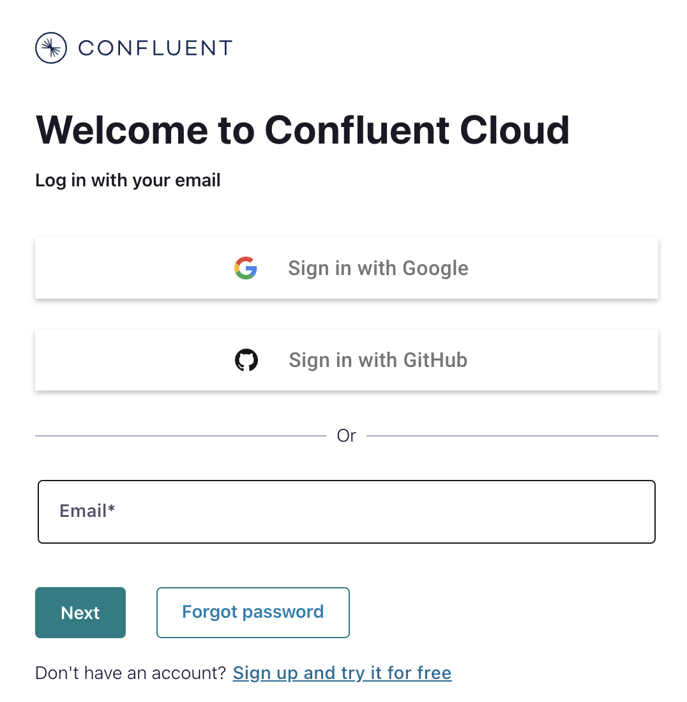
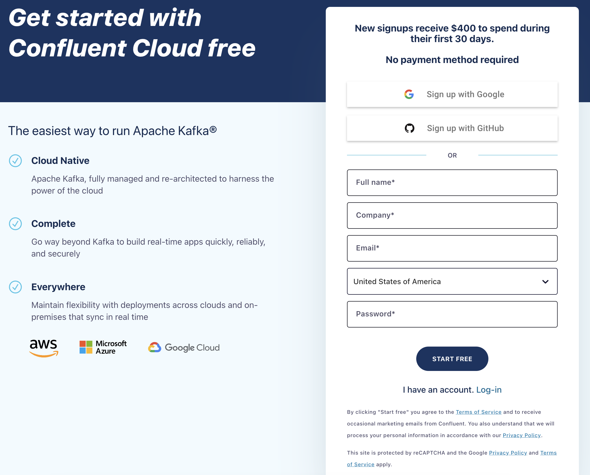
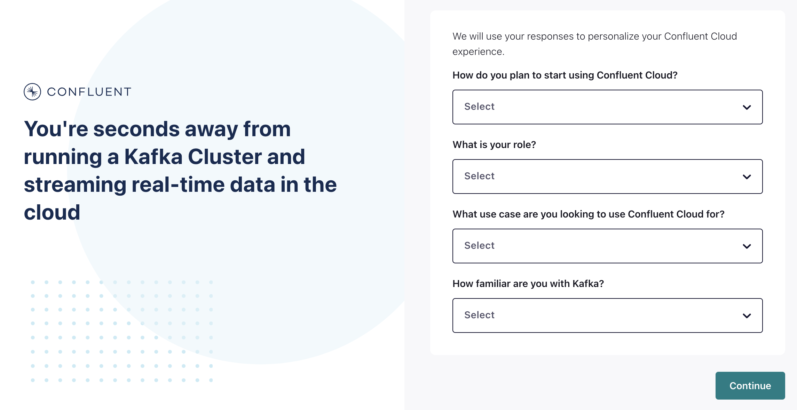

This first hands-on is meant to show you how quick and easy it is to connect to Confluent Cloud. After signing up you'll be able to use this Kafka cluster throughout the rest of the course to follow along with the other hands-on exercises.

## Setting up your Confluent Cloud account
If you already have a Confluent Cloud account and would like to use it for the hands-on exercises, feel free to proceed to the next module.  Otherwise, I'll walk you through creating a new account to use for this course. Head to [Confluent Cloud](https://confluent.cloud) and click Sign up and try it for free. 

Enter your name, company, email, and country then choose a secure password. If you already have an account click the Log-in below the form.

Be sure to remember these sign-in details as you'll need them later to access your account.

Click Start free and wait for your confirmation email to arrive.

The link in the confirmation email will lead you to the next step where you'll be prompted to answer a few questions on how you plan on using Confluent Cloud. Select the best answer and click Continue.

Claim the free credit to get additional credit to spend in your first 30 days. 

You'll now be asked to set up your cluster.

You'll notice you have a few different options you can select from Basic, Standard, or Dedicated cluster. Basic and Standard clusters are serverless offerings where your free Confluent Cloud usage is only exhausted based on what you use.

One note before we get started, once we're done going through this first example, don't forget to come back and stop and delete any resources that you may have created to avoid exhausting that free usage. Then after the class, come back, play, mess around a little bit and have fun. The free credit plus the credit from this class should offer you quite a bit of time to test and get a feel for what Confluent Cloud has to offer.

The next section is we need to choose which region and zone. I'm going to go ahead and select AWS and select the zone that is closest to me. 

In this case, it's Oregon. I only need this in a single zone of availability and so I'm going to go ahead and click Continue.

At this point, it will prompt you for a credit card or promo code. Feel free to skip both, or use this as a chance to add the promo code for this course. You can also opt to skip adding your payment at this time.

Take one last look at the choices you've made and go ahead and give your cluster a name. Once you are pleased, click Launch Cluster.

It may take a minute for your cluster to be provisioned, but I found it's usually pretty quick, and that's it.

All right, now that our cluster is ready to go, I can go ahead and click on the cluster either at the top or over on the left-hand side. 

You are now ready to complete the hands-on exercises in this course. You can also use this Kafka cluster to take additional courses or test other features of Confluent Cloud. 
