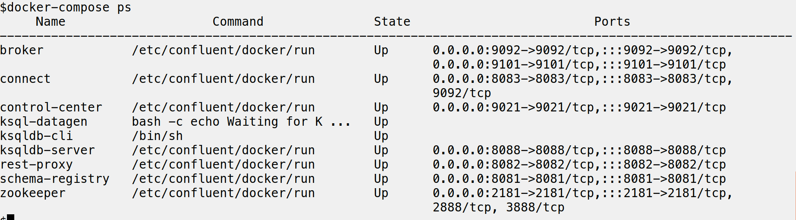
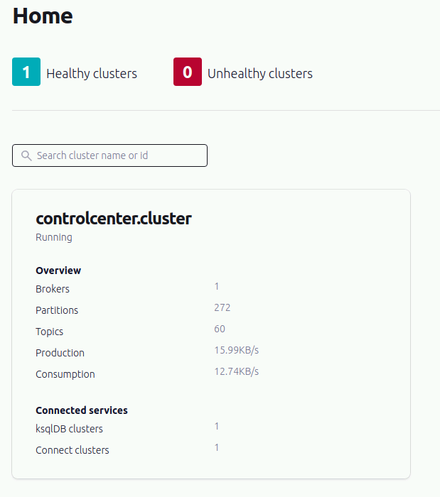
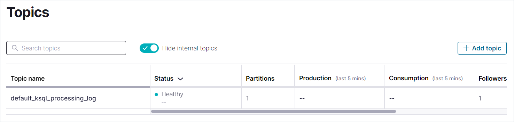
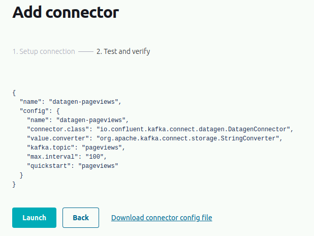
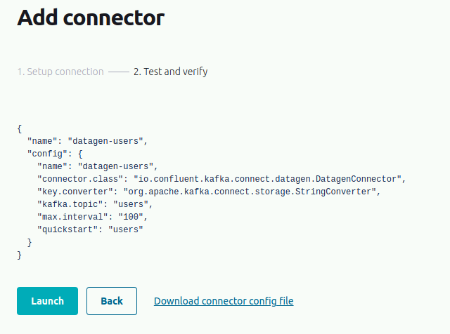

# Hands-on: Configuring Confluent Replicator

Confluent Replicator allows you to replicate topics from one Kafka cluster to another. In addition to copying the messages, Replicator will create topics as needed preserving the topic configuration in the source cluster. This includes preserving the number of partitions, the replication factor, and any configuration overrides specified for individual topics.

In this module, we'll take a look at how to configure Confluent Replicator.

For this module, we'll be using the Docker image Confluent Platform all-in-one container to configure our local install of Apache Kafka. Think of this as your on-premise installation. For our second cluster, we'll be using Confluent Cloud. 

If you already have a sample cluster ready with data, feel free to skip **Step 1** and move on to **Step 2**. You can also skip **Step 2** if you followed along with the first hands-on in the course where we set up our Confluent Cloud account and cluster. 

## Step 1: Download and Start Confluent Platform

1. Download or copy the contents of the [Confluent Platform all-in-one Docker Compose file](https://github.com/confluentinc/cp-all-in-one/tree/7.3.2-post/cp-all-in-one/docker-compose.yml), for example:
 
`curl --silent --output docker-compose.yml \
https://raw.githubusercontent.com/confluentinc/cp-all-in-one/7.3.2-post/cp-all-in-one/docker-compose.yml`

2. Start the Confluent Platform stack with the -d option to run in detached mode:

`docker-compose up -d`

Depending on your internet connection, this step might take quite a while.

3. Verify that all the services are up and running: 

`docker-compose ps`

Your output should resemble this:

4. Navigate to Confluent Control Center at [http://localhost:9021]
5. Click the **controlcenter.cluster** tile.

6. Click on **Topics** and then click the **Add topic** button.  

7. In the **Topic** name field, enter `pageviews` and click **Create with defaults**. Topic names are case-sensitive.
8. Follow the same steps to create a `users` topic.
9. Now that we have our two topics created, we need to create some dummy data using the Datagen Source Connector. We will store the data generated in both the `pageviews` and `users` topics we just created.
10. In the navigation menu, click **Connect**
11. Click `connect-default` in the list. 
12. Click **Add connector**.
13. Select the `DatagenConnector`
14. In the **Name** field, enter `datagen-pageviews` as the name of the connector.
15. Enter the following configuration values:
    - Key converter class: `org.apache.kafka.connect.storage.StringConverter`
    - kafka.topic: `pageviews`
    - max.interval: `100`
    - quickstart: `pageviews`

16.  Click **Launch**
17.  Follow the same process to create the sample data for the `users` topic.
18.  Click **Add connector**.
19.  Select the `DatagenConnector`
20.  In the **Name** field, enter `datagen-users` as the name of the connector.
21.  Enter the following configuration values:
    - Key converter class: `org.apache.kafka.connect.storage.StringConverter`
    - kafka.topic: `users`
    - max.interval: `100`
    - quickstart: `users`

22. Verify that data is coming in by clicking on **Topics** and then **users** and then **Messages**. You should see the messages as they come in.

## Step 2: Set up Confluent Cloud

