# Hands-on: Configuring Cluster Linking

Cluster Linking enables you to directly connect clusters and mirror topics from one cluster to another. Cluster Linking makes it easy to build multi-datacenter, multi-region, and hybrid cloud deployments. It is secure, performant, tolerant of network latency, and built into Confluent Server and Confluent Cloud.

In this hands-on, we'll configure Cluster Linking between two cloud clusters located in different regions and on different cloud providers, Amazon AWS and Google Cloud. 

Since we'll be using Confluent Cloud to perform this hands-on, make sure that you've gone through the first hands-on in the course, or that you have an account that allows you to set up and manage environments. For our source cluster you can you use any cluster type, Basic, Standard, or Dedicated. However, for the destination cluster, you will need to have a Dedicated instance.

## Set up Confluent Cloud

1. The first step is making sure that you have an Environment set up on Confluent Cloud that you can use for this hands-on. You'll want to create one using the Essentials Stream Governance Package on AWS near where you are located. I'll name mine `ClusterLinking`. 
2. Next, create a Cluster by clicking Create cluster on my own
   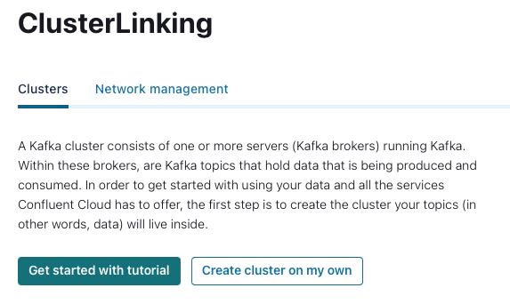

3. Select Begin Configuration for a Basic cluster.
4. Select where you want your cluster to be located. I'm going to select Google Cloud, Las Vegas, with a single zone of availability. 
   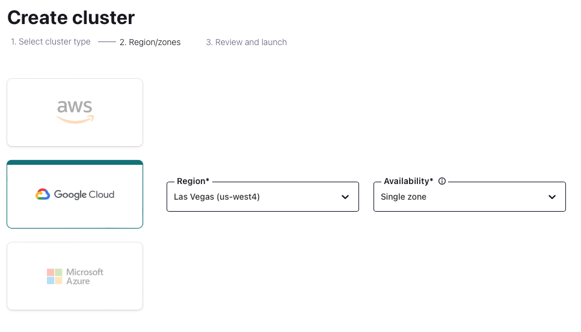

4. Since this will be my source cluster, I'll use a name that makes following this hands-on easy. `Orders_USWest_Source`. You will most likely already have a naming convention you'd like to follow or clusters that have already been named.  
   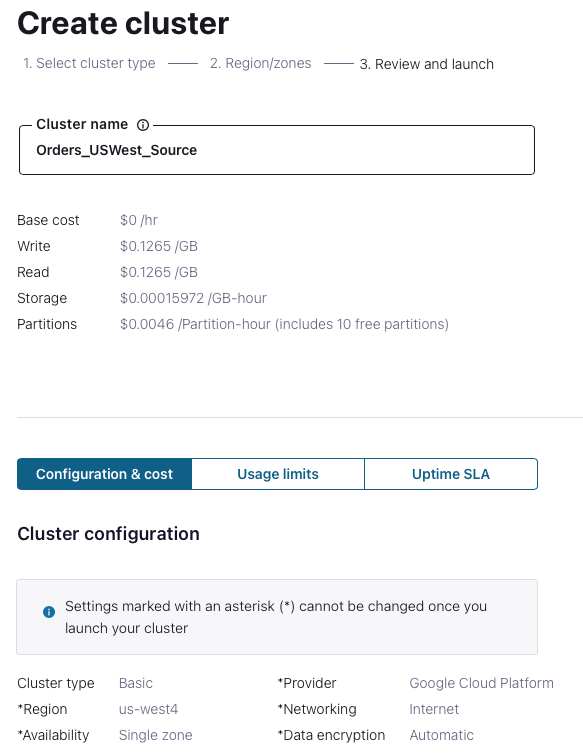

5. Click Launch Cluster
6. Since we will need another cluster to set up Cluster Linking, navigate back out into your environment and add a new cluster.
7. As mentioned above, this one needs to be a Dedicated cluster.
8. This time I'll select AWS, North Virginia, with a single zone for my availability.
   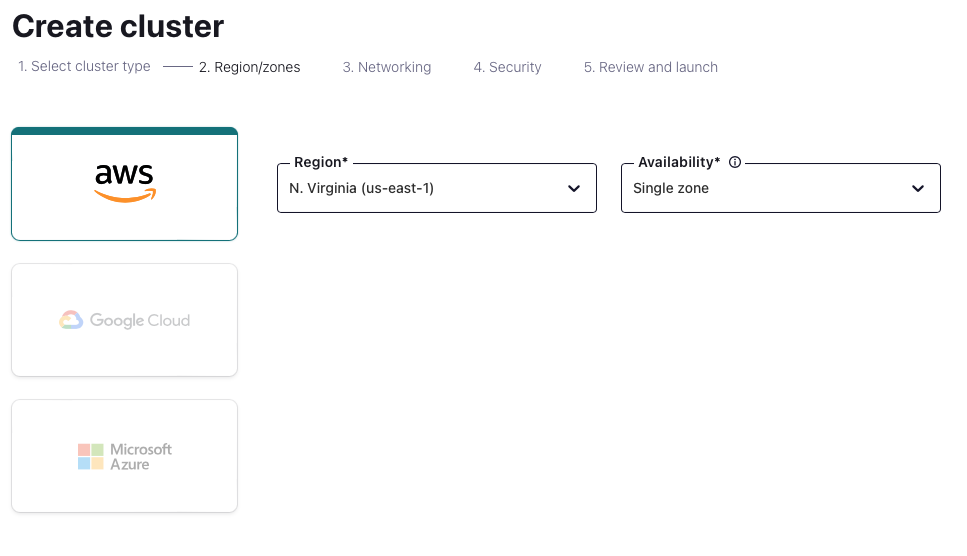

9. Select Internet and then Continue.
10. Select Automatic and then Continue.
11. Name your new cluster. Similar to our source, I'll name this one `Orders_USEast_Destination`. Again, you'll want to name it something that fits in with your set up and naming convention.
12. Review the summary and click Launce cluster.
    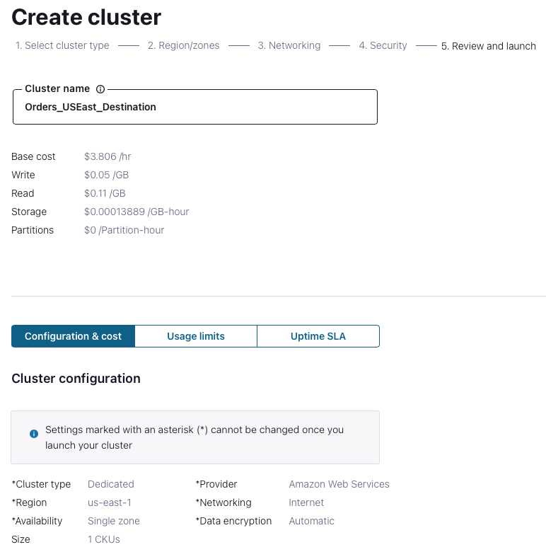

While we wait for the dedicated cluster to be created, let's get the data flowing into our source cluster.

13. Click on the `Orders_USWest_Source` cluster and navigate into Connectors on the left of the screen. 
14. Select the Datagen Source connector.
15. Click Add a new topic.
16. Pick a name and set up the number of partitions you'd like. In this case, I'll name the topic `Orders_West` with 3 partitions. 
    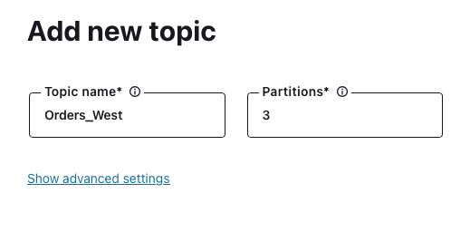

17. Click Create with defaults
18. Select the topic we just created and click Continue.
    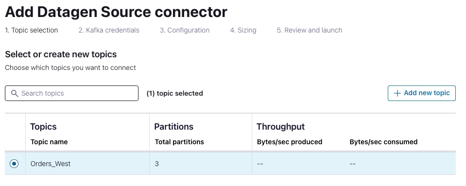

19. Select Global access and click Generate API key & download.
20. Give the API key a description and click Continue.
21. Select Avro and the Orders dataset and click Continue.
22. Leave the Connector sizing at 1 and click Continue.
23. Name the Datagen Connector, or accept the default name and click Continue.
24. Once the Datagen connector has been provisioned you can go into your Topics, `Orders_West` topic, and click on Messages to see the data flowing in. 

We now have two clusters, one Basic that will serve as our source cluster that has our topic and data flowing in, and one Dedicated that will be our destination cluster. 

We'll now set up our Cluster Link from the source to the Destination cluster.

25.  Make sure your Dedicated cluster is provisioned before starting the next step. Go to your  ClusterLinking Environment and it should look similar to the image below. You should be able to see that your source cluster has data flowing through it, but the destination cluster does not as we haven't configured anything yet. 
    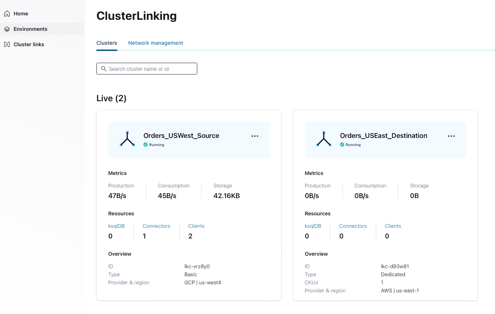

26. Let's create the cluster link by clicking on the Cluster Link menu on the left of the screen.
27. Click Create cluster link
28. This screen allows you to configure three types of links, in your own organization, in another organization, or from either Confluent Platform or Apache Kafka. We will select Confluent Cloud, our ClusterLinking Environment, and the source, `Orders_USWest_Source`. We will also provide this cluster link with read-all access. You could also configure specific access if need be by selecting Granular access.
    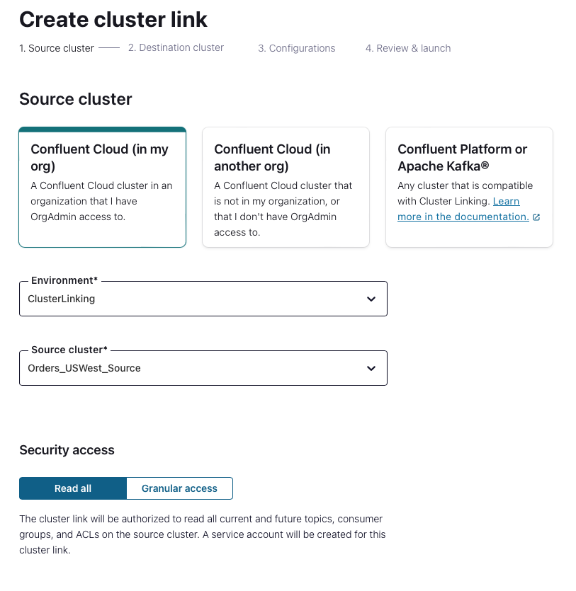

29. Click Continue
30. Now we will select our destination environment and cluster.
    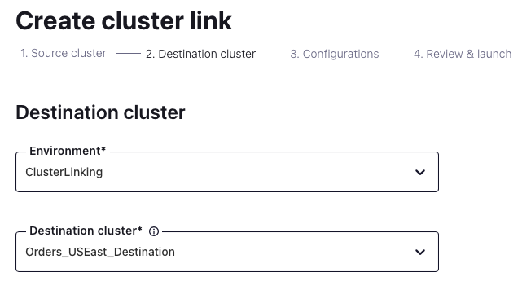

31. Click Continue
32. There are a few different configuration options that need to be selected. In this case, I want the Cluster Link to auto-create mirror topics, add a prefix to my mirror topic and sync my consumer offsets as well.
    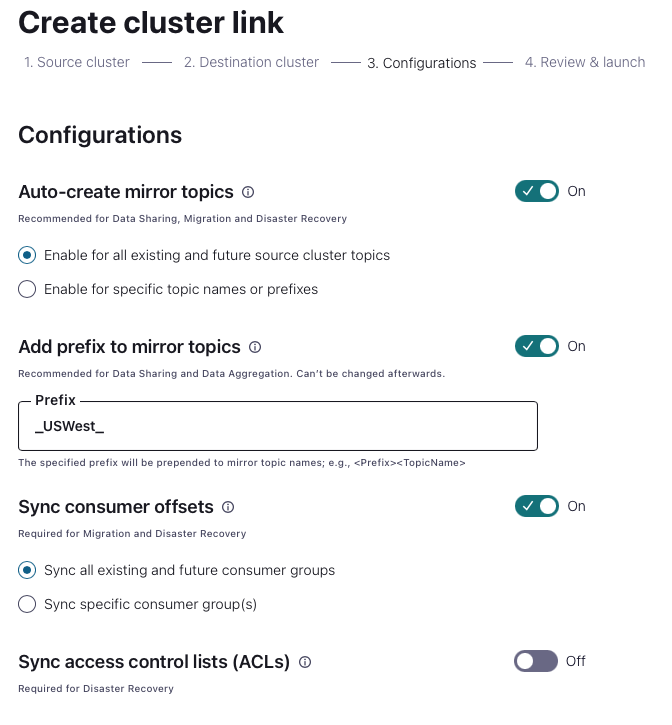

33. Click Continue.
34. Name the Cluster Link, in this case I'll name it `Orders_USWest-East`
35. Click Launch cluster link.
36. Now we have to set up which topics we want to be mirrored. Click Add mirror topic.
37. Select `Orders_West` from the dropdown and click Add.
38. You can now navigate to your Destination cluster and see the newly created mirror topic with all the messages coming in.
39. Congratulations! You have successfully set up a Cluster Link.

In the next module, we'll extend our cluster link to working with international locations and creating a global hybrid architecture. 